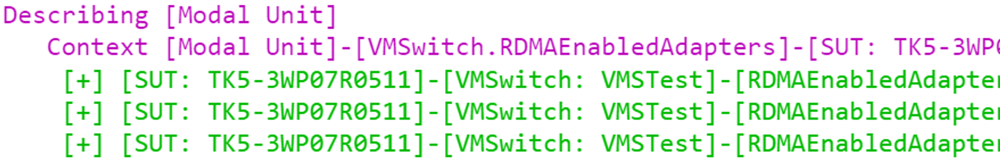
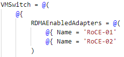
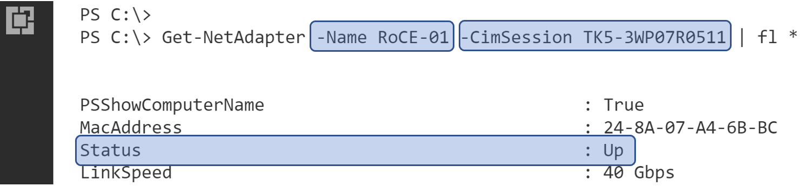
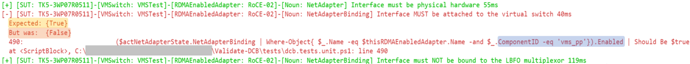
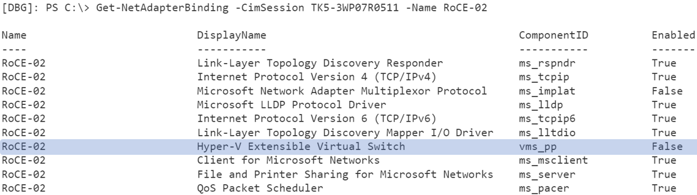
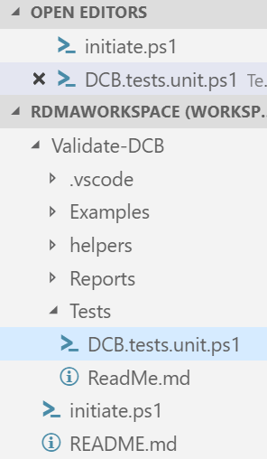
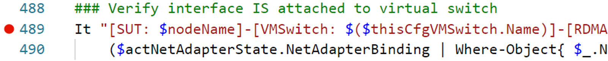
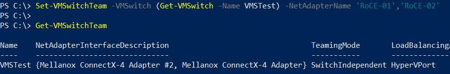
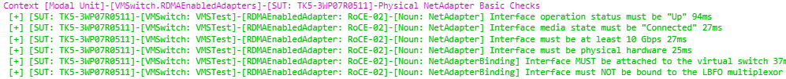

[](https://ci.appveyor.com/project/MSFTCoreNet/Validate-DCB)
[](https://www.powershellgallery.com/packages/Validate-DCB)

## :star: More by the Microsoft Core Networking team

Find more from the Core Networking team using the [MSFTNet](https://github.com/topics/msftnet) topic

##### What's New in v2.1

For more information, please see [What's New](WhatsNew.md)

##### Getting Started

1) [Learn the Tool](#Description)
3) [Customize your Config](Examples)
4) [Initiate Testing](#Initiate-Testing)

# Description

Validate-DCB v2.1 is a PowerShell-based unit test tool that allows you to:

&emsp;&emsp;
:heavy_check_mark: Validate the expected configuration on one to N number of systems or clusters

&emsp;&emsp;
:heavy_check_mark: Validate the configuration meets best practices

Additional benefits include:

&emsp;&emsp;
:heavy_check_mark: The configuration doubles as DCB documentation for the expected configuration of your systems.

&emsp;&emsp;
:heavy_check_mark: Answer ****"What Changed?"**** when faced with an operational issue (see [Test Results](#Test-Results))

&emsp;&emsp;
:heavy_check_mark: [New with version 2] Deploy the configuration to nodes

> :information_source: ****Note:****
> This tool does not modify your system unless you specify the -Deploy command. 
> As such, you can re-validate the configuration as many times as desired.

# Overview

RDMA over Converged Ethernet (RoCE) requires Data Center Bridging (DCB) technologies to make a network fabric lossless.  The configuration requirements are complex and error prone, requiring exact configuration and adherence to best practices across:

&emsp;&emsp; :arrow_right: Each Windows Node

&emsp;&emsp; :arrow_right: Each network port RDMA traffic passes through on the fabric

This tool aims to validate the DCB configuration on the Windows nodes by taking an expected configuration as input and unit tests each Windows system.

> :heavy_exclamation_mark: ****Important****: The validation of the network fabric is out-of-scope for this tool 

# Scenarios

Validate-DCB will provide configuration validation for one or more nodes or clusters across a variety of scenarios including:

&emsp;&emsp; :arrow_right: **Native RDMA Adapters (Mode 1)**

&emsp;&emsp; :arrow_right: **Host vNIC RDMA (Mode 2)** with vNICs in the parent partition

&emsp;&emsp; :arrow_right: **Combination scenarios** with both Native RDMA and Host Virtual NICs

&emsp;&emsp; :arrow_right: **Multiple virtual switches** with RDMA enabled adapters

> :warning: For step-by-step configuration instructions, please see the [Converged NIC Guide](https://aka.ms/ConvergedRDMA).  Alternatively, you can use the deployment options in version 2

# Test Overview

## Test Types
Currently all tests in Validate-DCB are unit tests.  That is, they break down and check individual configuration items one by one, rather than a holistic or functional test. In the future, we may incorporate integration/acceptance testing.

Tests are broken down into two types:

&emsp;&emsp; :arrow_right: ****Global**** - Tests the TestHost, Each SUT, and Configuration File for prerequisites

&emsp;&emsp; :arrow_right: ****Modal**** - Tests each SUT for RDMA and configuration best practices

For more information, please see [Test Details](\tests\readme.md)

## Test Results

### Testing with Azure DevOps and a CI/CD pipeline
Besides the on-screen feedback provided by the tool, results of the tests are stored in NUnitXML format in the \Results folder.  These Results can be stored for historical reasons and take part in a CI/CD pipline as shown in [Building a Continuous Integration and Continuous Deployment pipeline with DSC](https://docs.microsoft.com/en-us/powershell/dsc/dsccicd)

### Simple report using PowerBi

You can also use PowerBi to make displaying results easy.  For more information, please see [Using the Results](Results)

## Interpreting Test Results

### How Test Output is Constructed
Tests are constructed hierarchically. ****Describing**** blocks contain one or more Context blocks. ****Context**** blocks contain one or more tests.  This is Pester terminology outside the scope of this documentation.  [Pester](https://github.com/pester/Pester/wiki/Pester) is a PowerShell-based unit testing framework included inbox with Windows 10, Server 2016 and Server 2019.


While we have future plans to include more sections, currently the only two possible describe blocks are:

&emsp;&emsp; :arrow_right: ****`[Global Unit]`**** tests requirements or prerequisites to run the modal tests

&emsp;&emsp; :arrow_right: ****`[Modal Unit]`**** tests a node's configuration or best practices


A context block is a group of one or more tests.  For example, Validate-DCB may test a physical NetAdapter's Advanced Properties including the VLANID or NetwordDirect (RDMA in driver terms) settings.  These would be grouped in the same context.

#### Describe or Context Titles

Each Describe, Context, and Test includes a title enclosed in square brackets [ ].  Information inside these square brackets are intended to guide you to the necessary details to either resolve a failing test, or understand what just passed.  Let's use this as an example:

<br><br/>

:arrow_right: ****`Describing [Modal Unit]`**** contains unit tests for the RDMA modes of operation (NDK mode 1 or 2)

:arrow_right: ****`Context`**** can be broken down as follows:

&emsp;&emsp; :arrow_right_hook: ****`[Modal Unit]`**** – The describe block this Context is within

&emsp;&emsp; :arrow_right_hook: ****`[VMSwitch.RDMAEnabledAdapters]`**** – The section of the config file currently being testing.

&emsp;&emsp; :arrow_right_hook: ****`[SUT: TK5-3WP07R0511]`**** – The hostname of the current System Under Test<br><br/>

In this example, the current context is used for testing an adapter that is expected to be enabled for RDMA and connected to a VMSwitch.

 This adapter exists below the VMSwitch section of the configuration file.
> 


> :white_check_mark: ****Note:**** During runtime, a variable named $ConfigData contains the information from the config file.  With a debugger attached, you can walk the variable like this:
>> ```PowerShell
>>    [DBG]: PS C:\> $ConfigData.AllNodes.VMSwitch.RDMAEnabledAdapters
>> ``` 

### Passing Tests
If your system passes a test you will see green text similar to this:

```diff
+ [SUT: TK5-3WP07R0511]-[VMSwitch: VMSTest]-[RDMAEnabledAdapter: RoCE-01]-[Noun: NetAdapter] Interface status must be "Up"
```


Using the above image as an example, you can interpret this **passing test** as:

&emsp; :arrow_forward: The *`SUT`* named ****`TK5-3WP07R0511`****

&emsp;&emsp; :arrow_right_hook: is expecting the *`RDMAEnabledAdapter`* named ****`RoCE-01`****

&emsp;&emsp;&emsp; :arrow_right_hook: intended to back the *`VMSwitch`* named ****`VMSTest`****

&emsp;&emsp;&emsp;&emsp; :heavy_check_mark: to have an ****`interface operation status of "Up"`****

You can verify this using the PowerShell noun identified in the test (in the example, this is `NetAdapter`).

&emsp;&emsp;&emsp;&emsp;

&emsp;

### Failing Tests 

If your system is incorrectly configured, the test will provide an error message on-screen.

Unlike most PowerShell scripts, red error messages do not indicate an exception or failing code.  Rather this (typically) is indicating a failing test.  Another words, this is highlighting something you need to fix.

Failing tests give information to identify the misconfiguration.  In the failing test shown below (<font color="red">red output</font>), the *`RDMAEnabledAdapter`* named ****`RoCE-02`**** on *`SUT`* named ****`TK5-3WP07R0511`**** was expected to be attached to the *`VMSwitch`* named ****`VMSTest`****.



As you can see above, the ****Enabled**** property corresponding to the: 

&emsp;&emsp;

By running Get-NetAdapterBinding on the SUT you can see this for yourself.



#### Reviewing the Tests

You may also find it useful to review the code generating the failing test.  To do this, navigate in the folder structure to the file and line specified in the test failure, for example:

This message identifies the file and line number of the failing test.

&emsp;&emsp;

Now navigate to the file and review the code.

&emsp;&emsp;

If you’re still stuck and want to review the variables during runtime, you can set a breakpoint on the line above that specified in the test failure (the test failed at line 490 so the breakpoint at 489 as shown here):

&emsp;&emsp;

> :warning: If searching for a test in the code,please be aware that parenthesis typically indicates variables that are being expanded. All other test descriptions should be searchable.
>
> For example, in this test description the exact driver version is specific to a particular NIC manufacturer (in this case 1.90.19240.0) and therefore, you cannot search for this in the test as it’s an expanded variable.
> 

### Resolving Test Failures
To complete our example above, we need to resolve the configuration issue.  To do this, we'll attach the adapter(s) to the VMSwitch so the binding is now enabled.



&emsp;


# Getting Started

## Installation

Extract the files in this repo to a folder on a system (TestHost) with connectivity to the system's being tested (SUT).

## Requirements

- <u>TestHost</u>: Windows 10, Windows Server 2016, or Windows Server 2019.  The TestHost can also be a SUT if it is the appropriate OS.

- <u>System Under Test (SUT)</u>: Windows Server 2016 or Windows Server 2019

- <u>Configuration File</u>: This is a file that defines the expected configuration on the SUTs.

## Configuration File

Regardless of the scenario, you need a configuration file to define the expected configuration on your systems.  You can use one of the example configurations or create your own.  With Validate-DCB v2.1 we recommend using the -LaunchUI cmdlet (default) to create the configuration for you.  For more information on customizing your own file, please see: [Customize your Config](Examples)

## Running the Initiate

Once you have chosen a configuration file, you're ready to begin testing.  To begin testing, run the initiate.ps1 PowerShell script.  We recommend using Visual Studio Code as their is a rich debugging experience available.

> :information_source: ****Note:****
> For full parameter help use: ```Get-Help .\Initiate.ps1```

Here are a few tips on the parameters of the initiate.

| Parameter | Description |
|-----------|-------------|
| TestScope  | Determines the describe block to be run. You can use this to only run certain describe blocks. For example: <br><br> Use ****Global**** if you just want to setup a test host or validate your systems are ready to be tested. <br><br> Use ****Modal**** if you have already know you have all the prerequisites met.|
| LaunchUI    | Use this parameter to launch a user interface that helps create a configuration file.
| ExampleConfig | Use this to select one of the pre-defined configuration files that will test a system in Mode 1 or Mode 2. For more information on the example configuration guides, please see [Examples](Examples).<br><br>For details about the configuration for these modes, please review the [Converged NIC Guide](https://aka.ms/ConvergedRDMA)|
| ConfigFilePath    | Use this parameter to specify the path to a custom configuration file.
| ContinueOnFailure | If a test fails in one of the Describe blocks, Validate-DCB exits prior to moving to the next Describe block allowing you to correct the issue. Use this to attempt all tests even if a test failure is detected. |
| Deploy | Use this parameter to deploy the configuration to all specified nodes prior to validating the configuration |
