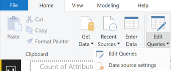
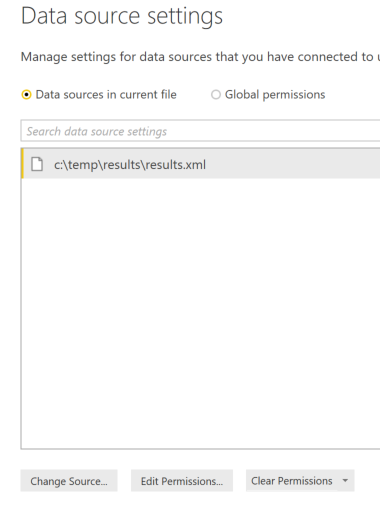
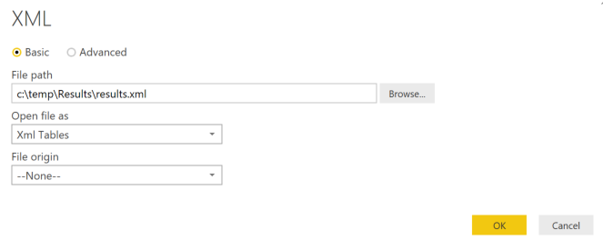
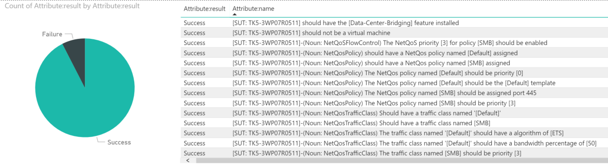

# Using the Results

Besides the on-screen feedback provided by the tool, results of the tests are stored in NUnitXML format in the \Results folder.  These Results can be stored for historical reasons and displayed using a variety of methods.

## Testing with Azure DevOps and a CI/CD pipeline

Our recommended method of displaying historical results is through integration with Azure DevOps (formerly VSTS).  There are a number of benefits to using this model including the source controlled code and build automation. For more information, please see [Building a Continuous Integration and Continuous Deployment pipeline with DSC](https://docs.microsoft.com/en-us/powershell/dsc/dsccicd)

## Basic view with PowerBi

A very basic review of the NUnitXML can be performed using the Validate-DCB.pbix PowerBi file stored in this folder. Please see this video for an example from Microsoft Premier Field Engineer, Jan Mortenson.

[](https://www.youtube.com/embed/FZcrdZM176Y

To leverage this you must update the source of the data to point to the results file generated by the tests.

To do this double click on the pbix file in the results folder of this repo.

Next, select ****Edit Queries**** > ****Data source settings****

&emsp;

Click ****Change Source****

&emsp;

Modify the ****FilePath****

Click ****OK****

Now refresh the data and you will see the report shown.

